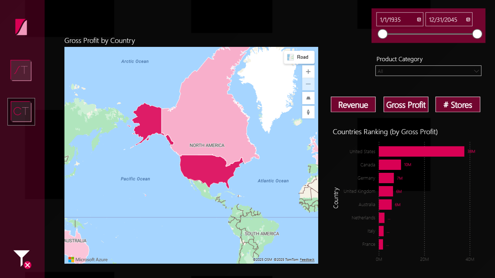
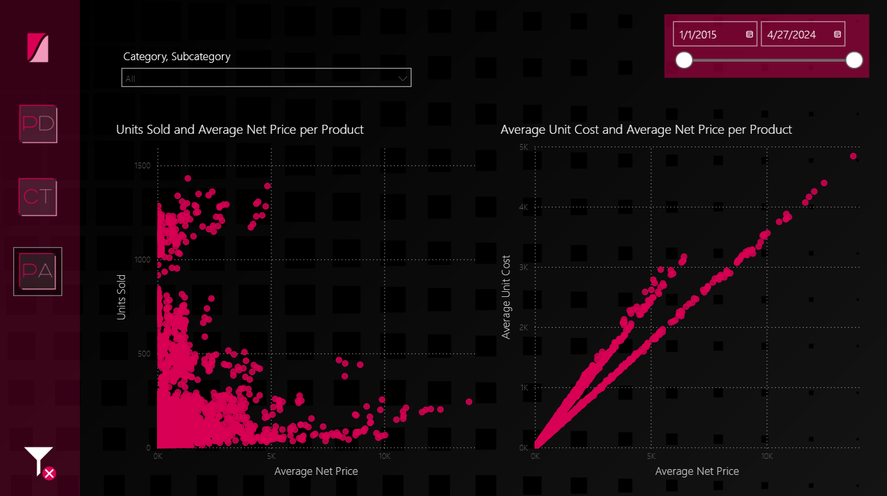

# Tomorrowstore

## Table of Contents

- [Overview](#overview)
- [Tools and Technologies](#tools-and-technologies)
- [Exploratory Data Analysis](#exploratory-data-analysis)
- [Data Modelling](#data-modelling)
- [Power BI Report](#power-bi-report)
- [Power BI Dashboard](#power-bi-dashboard)
- [Key Insights](#key-insights)
- [Powerpoint Presentation](#powerpoint-presentation)
- [Data Source](#data-source)
- [References](#references)


### Overview

The following data analysis project comprises some reports over a business database, with datasets representing the operations of _TomorrowStore_, a fictional retail company specialized in technology. 

The main goal of this work is to provide analytical tools to different areas in the company (Finance, Marketing, Sales, etc.), while also delivering an executive summary for the C-level. Finally, a PowerPoint file will be developed, as if it were to show the main results of Q2 2023 in a presentation by John Doe, Tomorrowstore's CFO, to the rest of the company.

### Tools and Technologies

- SQL Server (Exploratory Data Analysis)
- Power BI Desktop (Data Modelling and Reports Development)
- DAX (Advanced Indicators)
- Power BI Service (Dashboard Development)
- PowerPoint and Adobe Illustrator (Presentation Development)

### Exploratory Data Analysis

The available data for this project consists in eight datasets. They are available in the [SQLBI](https://www.sqlbi.com/tools/contoso-data-generator/) website. They are based on the _Contoso_ Microsoft dataset:

- [currencyexchange.csv](files/datasets/currencyexchange.csv): Currency exchange values for different dates.

- [customer.csv](customer.csv): Information about each customer.

- [date.csv](files/datasets/date.csv): A date table comprising all possible dates to be assigned to the data.

- [orderrows.csv](files/datasets/orderrows.csv): A row per each product purchased in an order.

- [orders.csv](files/datasets/orders.csv): A row per each order purchased.

- [product.csv](files/datasets/product.csv): Information about the different products sold by the company.

- [sales.csv](files/datasets/sales.csv): A row per each product purchased in an order.

- [store.csv](files/datasets/store.csv): Information about all stores.

As a first step, an initial exploration was performed in SQL Server for each of the files. The queries can be found in the respective SQL files inside [this folder](files/SQLfiles). Then, more detailed aspects were checked directly on PowerQuery, after loading the datasets.

The steps taken and main results can be summed up as follows:

**Initial queries:**

All datasets were queried to have a first look to their different columns and values in them. The commands used to create the tables in SQL and then query them were:

```
BULK INSERT Table_Name
FROM '…\table-file.csv'
WITH (
		FIRSTROW = 2,
        		FIELDTERMINATOR = ',',
        		ROWTERMINATOR = '\n'
    	)

SELECT * FROM Table_Name;
```

At a first glance, the “sales.csv” dataset had the same information as the “orderrows.csv” and “orders.csv” files combined, with the respective exchange value from the “currencyexchange.csv” file. To check this, a new table was created by joining the three files, and then compared to the “sales.csv” dataset, with the following command:

```
SELECT * FROM Old_Table
INTERSECT
SELECT * FROM New_Table;
```

This query returned all rows in the tables, which showed that our first supposition was correct. As a result, “currencyexchange.csv”, “orderrows.csv” and “orders.csv” were not considered for the rest of the analysis.

**General information:**

After this initial exploration, all datasets were loaded into Power Query, where further analysis and some transformations were performed. Firstly, the number of rows and columns were obtained for each table:

|Table|Num. of Rows|Num. of Columns|
|---|---|---|
|customer.csv|104990|24|
|product.csv|2517|14|
|sales.csv|199873|13|
|store.csv|74|11|

**Null values:**

The number of null values per column was obtained by checking the column quality view in Power Query. Most columns with null values were not considered in further steps, except for _CloseDate_. In this case, stores with no close date were considered open.

- customer.csv:

|Column|% of Null values|
|---|---|
|Company|<1%|

- product.csv:

|Column|% of Null values|
|---|---|
|WeightUnit|10%|
|Weight|15%|

- store.csv:

|Column|% of Null values|
|---|---|
|CloseDate|78%|
|SquareMeters|1%|
|Status|80%|

**Data types:**

In all tables, the data types were automatically configured with the loading process in Power Query. Most columns in all tables are text-type (with data such as codes, locations, names, etc.), some are number-type (mostly representing prices, costs, products and customers characteristics, etc.), and others are date-type (with sales dates, stores opening and closing dates, etc.)

**Statistical summary:**

Some general statistical indicators were drawn for numeric columns, using the column profile view in Power Query.

- customer.csv:

|Column|Minimum|Maximum|Mean|Standard deviation|
|---|---|---|---|---|
|Age|19|85|51.384|19.1776|
|Latitude|-43.3465|-10.0262|-32.6165|5.3336|
|Longitude|114.3860|156.3118|143.9523|10.2978|

- product.csv:

|Column|Minimum|Maximum|Mean|Standard deviation|
|---|---|---|---|---|
|Weight|0.17|90.8|14.2437|15.3394|
|Cost|0.48|960.82|139.7715|152.0434|
|Price|0.95|2899.99|338.6505|431.3865|

- sales.csv:

|Column|Minimum|Maximum|Mean|Standard deviation|
|---|---|---|---|---|
|LineNumber|0|6|1.147|1.3503|
|Quantity|1|10|3.048|2.2541|
|UnitPrice|3.486|3247.5|331.657|484.2206|
|NetPrice|3.0328|2825.325|310.3308|449.9586|
|UnitCost|1.778|1075.95|134.5462|178.816|
|ExchangeRate|0.6416|1.2907|0.946|0.1784|

- store.csv:

|Column|Minimum|Maximum|Mean|Standard deviation|
|---|---|---|---|---|
|SquareMeters|245|3500|1494.7945|691.7959|

**Cardinality:**

For each dataset, the number of distinct values per column was checked with the column profile view. Each table has its own natural key in a single column (except for “sales.csv”):

- customer.csv: _CustomerKey_
- product.csv: _ProductKey_
- sales.csv: Concatenation of _OrderKey_ and _LineNumber_
- store.csv: _StoreKey_

### Data Modelling

A semantic model was built on Power BI, with a fact table: _Sales_ (based on sales.csv), and three dimension tables: _Customer_, _Product_, and _Store_ (respectively based on each homonymous dataset).

The data from the files was first uploaded to Power BI and transformed in the PowerQuery editor. For all tables, data types were revised and changed when needed (e.g. codes were transformed from number-type into text-type).

In addition, the text values “Contoso” and “Contoso Store” were replaced for “TomorrowStore”, to represent products and stores belonging to the company this project refers to. More precisely, these changes were made in _Products_ (for _ProductName_, _Manufacturer_, and _Brand_ columns) and _Store_ (for _Description_ column). 

After creating the four main tables, some dimension tables were added, both as Power Query tables and DAX calculated tables:

- Firstly, two location tables were created, to represent separate relationships to _Customer_ and _Store_ (and, through them, to _Sales_). This was done by creating a _locationsource_ table with the location-related columns from “customer.csv”, a second _LocationStore_ table based on “store.csv”, and merging both into _LocationStore_ (only keeping _GeoAreaKey_, _Continent_, _State_, and _Country_). After deleting all duplicate rows, this table was copied into a new _LocationCustomer_ table.

- Secondly, three date tables were created to represent one-to-many relationships to _Customer_, _Sales_, and _Store_. These were: _DateCustomerBirthday_, _DateCustomer_, _DateSales_, and _DateStore_. They were created by using the `CALENDAR()` function over the union of the date columns of each table (that is, to consider the widest possible range of dates in each whole table). Additionally, an _AllDatesAnalysis_ table was created, using the `CALENDARAUTO()` function, with no relationships to other tables, just to be used in measures and visuals.

- Finally, a _ProductPairAnalysis_ table was created in Power Query, as a way to show which pairs of products were purchased most frequently. This was done by following these steps:
1. Reference _Sales_ into a new query.
2. Group its rows by _OrderKey_.
3. Generate a list of all possible product pairs for each order (each product with its _ProductKey_ and _ProductName_ columns).
4. Expand the list for each order into separate columns.
5. Group the rows of this new table by all their columns. This way, a new _Frequency_ column shows how many times each combination of two products has taken place.

Many measures were created in DAX, for later use in visuals:

- Customers: _ActiveCustomers_, _CustomersWithOrders_, _AverageCustomerRevenue_, _CustomerRetentionRate_, _RepeatPurchaseRate_.
- Financial & Sales: _AverageOrderValue_, _CostOfSoldGoods_, _GrossProfit_, _GrossProfitMargin_, _MoM_GrossProfit_, _MoM_Revenue_, _Revenue_, _YoY_GrossProfit_, _YoY_Revenue_.
- Stores: _ActiveStores_.

The following calculated columns were created for their use on _Financial & Sales_ measures:

- SaleNetPrice(USD) = `Sales[NetPrice] * Sales[Quantity] * Sales[ExchangeRate]`
- SaleCost(USD) = `Sales[UnitCost] * Sales[Quantity] * Sales[ExchangeRate]`
- SaleProfit(USD) = `Sales[SaleNetPrice] – Sales[SaleCost]`

In addition, the following columns were added to _Customer_, to be used in measures and visuals:
- FullName (in Power Query) = `Table.AddColumn(#"Filtered Rows", "FullName", each [Surname] & " " & [GivenName] & " " & [CustomerKey])`
- IsActive (in DAX) = `AND(Customer[StartDT] <= TODAY(), Customer[EndDT] > TODAY())`
- NextBirthday (in DAX) = 
```
VAR ThisYearBD = DATE(YEAR(TODAY()), MONTH(Customer[Birthday]), day(Customer[Birthday]))
VAR NextYearBD = DATE(YEAR(TODAY()) + 1, MONTH(Customer[Birthday]), day(Customer[Birthday]))
RETURN
IF(
    ThisYearBD >= TODAY(),
    ThisYearBD,
    NextYearBD)
```

The following image shows the definitive semantic model, which can be accessed downloading the [file](tomorrowstore-datamodel.pbix) from this Github repository.


### Power BI Report

The model was published into Power BI Service and used as a data source for all reports. Each report was created using specific columns and measures from this model.

The first report, _Financial & Sales_, shows general economic indicators about TomorrowStore’s activity, such as revenue and profit ([Web version](https://app.powerbi.com/view?r=eyJrIjoiZWM0ODAwMzMtYjY2Yy00ODU4LTgzNWItMmU3N2U3NDZmYjA0IiwidCI6IjM1NDg3YTU2LTFlNGYtNDAzNC04ODNkLWViYjBiMDMxZDNjNCIsImMiOjR9&pageName=b00d3c878e8da03d4502) and [Power BI file](files/tomorrowstore-financial-&-sales.pbix) available). It has a Front Cover and the following three pages:
- General stats: It shows cards with Revenue, Average Order Value, Gross Profit, CoGS, and Gross Profit Margin. It also has a date slicer.
 

- Revenue: It shows cards with Revenue and Average Order Value. It also shows a line chart with revenue comparison over different periods of time (with buttons to change between Year-to-year and Month-to-month Revenue). In addition, it has slicers to select Countries, Product Categories, Products, and Dates.

 
- Gross Profit: It has the same visuals and slicers as the previous page, but showing Gross Profit and CoSG instead of Revenue and Average Order Value.


The second report, _Stores_, shows indicators and detailed information about stores([Web version](https://app.powerbi.com/view?r=eyJrIjoiNWYyZjYzYjItNmUzZi00ZTY0LWIxMTUtYTdhZjA3MmYxYWNjIiwidCI6IjM1NDg3YTU2LTFlNGYtNDAzNC04ODNkLWViYjBiMDMxZDNjNCIsImMiOjR9&pageName=68868b844640761e4c9d) and [Power BI file](files/tomorrowstore-stores.pbix) available). It has a Front Cover and the following two pages:
- Stores: It shows a card with the total Number of Stores and a bar chart with the Top 10 Stores (with buttons to change between two dimensions: Revenue and Gross Profit). It also has slicers to select Countries, Product Categories, and Dates.

 
- Countries: It shows a filled map at the Countries level and a bar chart with a ranking of Countries (with buttons to change between three dimensions: Number of Stores, Revenue, and Gross Profit). It also has slicers to select Product categories and Dates.


The third report, _Products_, shows indicators and detailed information about TomorrowStore’s products([Web version](https://app.powerbi.com/view?r=eyJrIjoiYjJmMTliYmItNzUzZC00ZmI1LWJjN2ItMDgzY2Y0MzA4ZmIxIiwidCI6IjM1NDg3YTU2LTFlNGYtNDAzNC04ODNkLWViYjBiMDMxZDNjNCIsImMiOjR9&pageName=ecda0458007646906962) and [Power BI file](files/tomorrowstore-products.pbix) available). It has a Front Cover and the following three pages:
- Products: It shows a card with the total Number of Products and a bar chart with the Top 10 Products (with buttons to change between four dimensions: Number of Customers, Units Sold, Revenue, and Gross Profit). It has a table that shows the Top Pair (or pairs) of Products most frequently bought together. It also has slicers to select Countries, Product Categories, Product Subcategories, and Dates.


- Categories: It shows two bar charts, one with the Top 3 Product Categories and the other with the Top 3 Product Subcategories (with buttons to change between four dimensions: Customers, Units Sold, Revenue, and Gross Profit). It also has slicers to select Countries and Dates.

 
- Price Analysis: It shows two scatter plot charts, one comparing Price to Units Sold, and the other comparing Price to Unit Cost. It also has slicers to select Product Categories, Product Subcategories, and Dates.


The fourth and last report, _Customers_, shows indicators and detailed information about TomorrowStore’s clients, with some visuals designed for direct actions ([Web version](https://app.powerbi.com/view?r=eyJrIjoiNzUyOTVkMDItOWE1MS00MDExLTk4MzYtNmZmMGZmNDU2NjhlIiwidCI6IjM1NDg3YTU2LTFlNGYtNDAzNC04ODNkLWViYjBiMDMxZDNjNCIsImMiOjR9&pageName=952f319e88830429ad99) and [Power BI file](files/tomorrowstore-customers.pbix) available). It has a Front Cover and the following three pages:
- Top Customers: It shows a card with the Number of Customers, a bar chart with the Top 10 Customers by Revenue, and a table with the Top 100 Customers whose birthday is on this day (to be used for mailing campaigns). It has slicers to select Countries.


- Customer Stats: It shows three cards, respectively representing Number of Customers with Orders (not to be confused with Active Customers), Average Customer Revenue, and Repeat Purchase Rate. It also has two line charts, showing the Customer Retention Rate and the evolution of the Number of Active Customers. In addition, it has a slicer to select Countries, and two more slicers to select Dates: one date relative to the cards and the Retention Rate line chart, and the other only affecting the Active Customers line chart. It should be noted that the Active Customers visual refers to customer creation and/or deletion dates, while the rest of the visuals refer to sales dates, hence the need for two different date slicers.

 
- Customer demographics: It shows a filled map at countries level with the Location of Customers. It also has a pie chart representing Sex, and a column chart for Age distribution. It has one slicer to select Dates.


The _Customers_ report is also available in a mobile version. Open access of this version is not possible, but can be granted on-demand by completing [this form](https://docs.google.com/forms/d/e/1FAIpQLScjgKNAqRjha7tfEe6AJcI6E5am05cwzXbEG2TH6gllG4AwvQ/viewform?usp=header) (resources are typically sent within 24hs).


### Power BI Dashboard

A dashboard, called _Executive Statistics_, was created as a summary of the main indicators to be followed by the C-level: Yearly Revenue, Yearly Gross Profit, Top 3 Product Categories by Profit, and Countries Ranking by Profit. It has a desktop and a mobile version.

Open access of this version is not possible, but can be granted on-demand by completing [this form](https://docs.google.com/forms/d/e/1FAIpQLScjgKNAqRjha7tfEe6AJcI6E5am05cwzXbEG2TH6gllG4AwvQ/viewform?usp=header) (resources are typically sent within 24hs).


### Key Insights

As stated at the beginning of this project description, the goal of the analysis was to extract the main Tomorrowstore's results in Q2 2023. The different reports allow to extract some interesting insights in this direction:

- Financial & Sales:
  - Total Revenue was 6.97M (millions of US dollars), while Gross Profit was 3.90M.
  - Both measures experienced a significant fall, of around 36%, in comparison with the same quarter of the previous year.

- Stores:
  - There were United States is the country with most stores (21), while the rest of the countries have from 2 to 8 stores each.
  - Online store is the most profitable one, with a Gross Profit of around 2.4M, followed by United States with 700K (thousands of US dollars).

- Products:
  - The top product category was Computers, both by Revenue and Gross Profit, while Cell Phones was the top category for number of Customers and Units Sold.
  - The to product by Revenue and Gross Profit was Adventure Works 52" LCD HDVT X590 Silver. By Customers, it was SD DVD 14" Player Portable L100 Black, and by Units Sold the top product was SV DVD Recorder L230 Grey.
  - Regarding the analysis of Price and Cost, there is a fairly evident correlation between the two variables (in general, the products which cost the most have the higher prices). With Price and Units Sold, the relation is not so clear: the cheaper products show a wide range of units sold, while the more expensive ones tend to have considerably less sales. 

- Customers:
  - There were 3164 customers in Q2 2023, with an average 2.20K Customer Revenue and a 3% of Repeated Purchase Rate.
  - These customers were roughly 50% males and 50% males, with more or less evenly distributed ages, the most frequent being from 41 to 60. Most clients were American (more than 1500).
 
By interacting with the different slicers, we can extract some further insights:
- The yearly drop in Revenue and Gross Profit was mostly concentrated in US and UK, with a fall of slightly more than 54%. The remaining locations, including the Online store, showed a considerable but milder drop, of almost 29%.
- This drop can be also analyzed in terms of product categories. For Audio, Games and Toys, and Home Appliances, the fall was around 5-7%, while it surpassed 41% for the remaining categories.
- Finally, the top 3 products (regarding Gross Profit) did not show a decrease, but a considerable growth in terms of yearly Revenue and Gross Profit, of around 27-29%.

### Powerpoint Presentation

As stated before, a PowerPoint file was be developed, showing many of the insights from the previous section, as if it was to be presented by John Doe, Tomorrowstore's CFO, to the rest of the company.

The [tomorrowstore-results.pptx](files/tomorrowstore-results.pptx) Powerpoint file can be found on this Github repository, or can be accessed as an [online PDF](https://acrobat.adobe.com/id/urn:aaid:sc:us:ee10616c-66e2-422a-acda-35ead12bf4a5) too.


### Data Source

All the datasets were extracted from the [SQLBI](https://www.sqlbi.com/tools/contoso-data-generator/) website.

### References

World map image in informational video by Al MacDonald [2]/ twitter account @F1LT3R, CC BY-SA 3.0, https://commons.wikimedia.org/w/index.php?curid=7469140
